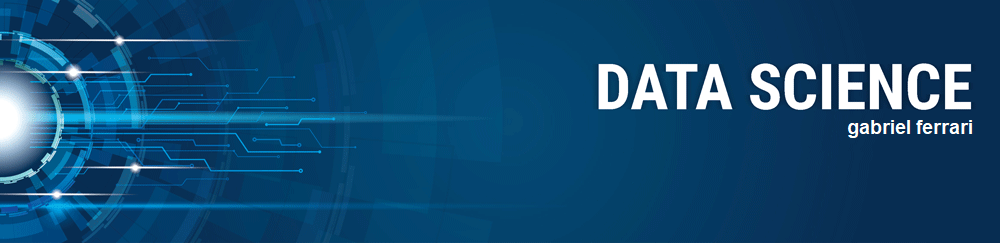

# DSNP1

  

# Gabriel Ferrari
*Engenheiro de Produção*

Formado em Engenharia de Produção desde dezembro de 2019, estou buscando o conhecimento em Data Science para que, junto com o conhecimento adquirido durante a graduação, eu possa ter acesso a novas ferramentas para conseguir buscar formas de resolver problemas.

**Links:**
* [LinkedIn](https://www.linkedin.com/in/ferrarigabriel07)
* [Medium](https://medium.com/@gabrielferrariveloso)

---
